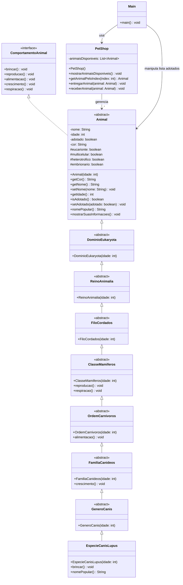

# PetShop Magico com Taxonomia Animal (POO em Java)

Este projeto implementa um mini sistema de adocao de animais em Java, usando Programacao Orientada a Objetos e uma hierarquia de classes inspirada na taxonomia biologica.

A ideia central do minimundo e:
- representar um `PetShop` com animais disponiveis para adocao;
- permitir interacao via console (adotar, listar, renomear e devolver);
- modelar caracteristicas biologicas por niveis taxonomicos (Dominio -> Reino -> Filo -> Classe -> Ordem -> Familia -> Genero -> Especie).

## O que o projeto faz

No fluxo principal (`Main.java`), o usuario pode:
1. visualizar animais disponiveis no petshop;
2. consultar detalhes de um animal;
3. adotar um animal e definir um nome;
4. listar animais adotados;
5. alterar nome de um animal adotado;
6. devolver animal para o petshop.

O `PetShop` inicia com quantidade aleatoria de cachorros (`EspecieCanisLupus`) e idades aleatorias.

## Estrutura do minimundo

### Classes principais
- `Animal` (abstrata): classe base com atributos comuns (`nome`, `idade`, `adotado`, `cor`) e metodos abstratos de comportamento.
- `ComportamentoAnimal` (interface): contrato de comportamentos biologicos e etologicos (`brincar`, `reproducao`, `alimentacao`, `crescimento`, `respiracao`).
- `PetShop`: gerencia estoque de animais disponiveis e operacoes de entrega/devolucao.
- `Main`: menu interativo no console.

### Cadeia taxonomica implementada
A taxonomia foi modelada por heranca em camadas, onde cada nivel adiciona caracteristicas ou comportamento:

1. `DominioEukaryota`:
- marca o animal como eucarionte (`eucarionte = true`).

2. `ReinoAnimalia`:
- marca o animal como multicelular, heterotrofico e embrionario.

3. `FiloCordados`:
- mantem a especializacao por filo (neste momento sem novo comportamento).

4. `ClasseMamiferos`:
- define reproducao sexuada e respiracao pulmonar.

5. `OrdemCarnivoros`:
- define alimentacao baseada em carne.

6. `FamiliaCanideos`:
- define tempo de crescimento tipico.

7. `GeneroCanis`:
- especializa o genero (sem metodos adicionais por enquanto).

8. `EspecieCanisLupus`:
- especie concreta usada no petshop;
- implementa `brincar()` e `nomePopular()` ("Cachorro").

## Como a taxonomia funciona no codigo

A classe `Animal` possui flags booleanas de taxonomia:
- `eucarionte`
- `multicelular`
- `heterotrofico`
- `embrionario`

Essas flags sao inicializadas gradualmente ao subir pela cadeia de construtores taxonomicos. Assim, ao instanciar `EspecieCanisLupus`, ele herda automaticamente todas as caracteristicas acumuladas dos niveis acima.

O metodo `mostrarSuasInformacoes()` em `Animal` usa essas flags e chama os metodos de comportamento para exibir um resumo biologico do individuo.

## Diagrama de classes (Mermaid)



## Fluxo de adocao no sistema

1. `PetShop` exibe animais disponiveis.
2. Usuario escolhe um indice para ver detalhes.
3. Se confirmar adocao, `PetShop.entregarAnimal(animal)` remove do estoque e marca como adotado.
4. Usuario define nome para o animal.
5. Animal e armazenado na lista de adotados em `Main`.

Na devolucao, o processo inverso ocorre com `PetShop.receberAnimal(animal)`.

## Como executar

No terminal, dentro da pasta do projeto:

```bash
javac *.java
java Main
```

Observacao importante: no estado atual do codigo, `Main` usa `static void main()` sem assinatura padrao de entrada. Para executar com `java Main`, o metodo deve ser:

```java
public static void main(String[] args)
```

## Conceitos de POO trabalhados

- abstracao: `Animal` e os niveis taxonomicos abstratos
- encapsulamento: atributos privados com getters/setters
- heranca: cadeia taxonomica completa
- polimorfismo: chamadas de comportamento definidas em niveis diferentes da hierarquia
- interface: contrato unico de comportamento com `ComportamentoAnimal`

## Possiveis evolucoes

- adicionar novas especies (por exemplo, `FelisCatus`) reutilizando a estrutura taxonomica;
- separar camadas de dominio e interface de usuario;
- incluir validacao de entrada para evitar indices invalidos;
- persistir adocoes em arquivo ou banco de dados.
